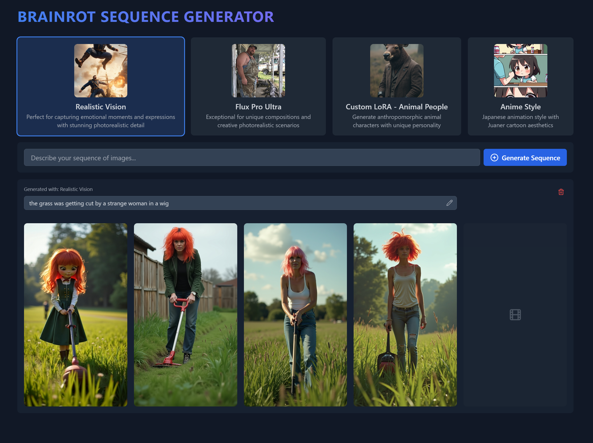

# AI Image & Video Generation Platform



## 🌟 Features

### Image Generation
- Generate sequences of AI-powered images
- Multiple model support (SDXL, etc.)
- Real-time image regeneration
- Dynamic prompt-based generation
- Beautiful transparent UI controls

### Video Generation (New!)
- Transform any generated image into dynamic videos
- Powered by FAL.ai Kling Video 1.6 Pro
- Choose between 5s and 10s video durations
- Seamless video playback integration
- Real-time progress updates

### User Interface
- Clean, modern design with transparent overlays
- Intuitive image and video controls
- Loading states and progress feedback
- Responsive layout
- Dark mode optimized

## 🚀 Getting Started

1. Clone the repository
```bash
git clone [repository-url]
```

2. Install dependencies
```bash
npm install
```

3. Set up environment variables
Create a `.env` file with:
```
VITE_FAL_API_KEY=your-fal-ai-key
```

4. Start the development server
```bash
npm run dev
```

## 🛠️ Tech Stack
- React + TypeScript
- Vite
- FAL.ai API
- TailwindCSS
- React Icons

## 📝 Environment Variables
- `VITE_FAL_API_KEY`: Your FAL.ai API key (required)

## 🔒 Security
- API keys are properly secured
- Environment variables for sensitive data
- No client-side key exposure

## 🤝 Contributing
Feel free to open issues and pull requests!

## 📄 License
MIT License - see LICENSE file for details